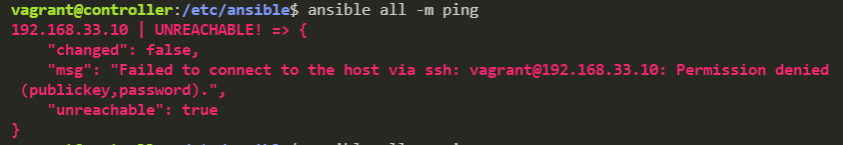
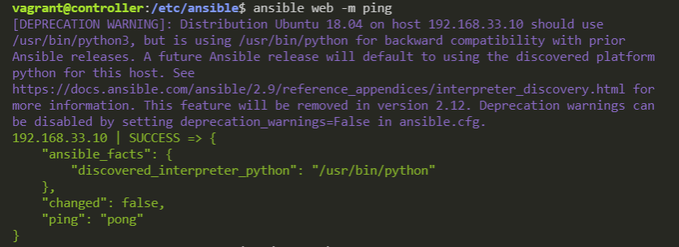
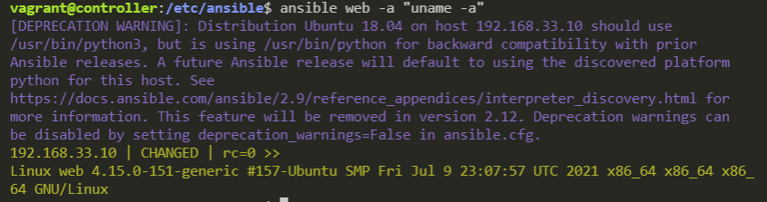

# Using Ansible - Infrastructure as Code
## What is Ansible?
Ansible is an automation tool that allows you to change settings on multiple machines while only using 1 controller machine. In our example, we will only be using 3 machines, but in realisty, Ansible can be used to change settings on 10's or even hundreds of machines.


### Setting up the machines

The `VagrantFile` will setup 3 machines:
1. Controller
2. Web
3. db

After initialising these machines, we want to set them up using:
1. `sudo apt-get update -y`
2. `sudo apt-get upgrade -y`

### Installing Ansible
We only need to install Ansible on 1 machine and not on the machines that are controlled by Ansible. This is known as "agentless".

To install Ansible, execute the following commands:
```
sudo apt-get install software-properties-common -y
sudo apt-add-repository ppa:ansible/ansible
sudo apt-get install ansible -y
```

We can confirm that Ansible is installed by using `ansible --version`. This command will give information on the installed Ansible version and the location of the default configuration directories.
This machine is now the Ansible controller machine.

### Manual SSH with Ansible
To SSH into the agent machines, simply run `ssh vagrant@[machine-ip]`, where `[machine-ip]` is substituted for the machines IP address.

Can test the the connection works by running any command. To exit back to the controller machine's terminal, use `Exit`.

### Ansible configuration file, pinging and SSH login
We can ping the machines using the Ansible command > `ansible all -m ping`

When we execute this command, we will see this output:
```
[WARNING]: provided hosts list is empty, only localhost is available. Note that the        
implicit localhost does not match 'all'
```

#### Define the agent machines and ping
We haven't defined what machines we want to control. So, we must now go into the Ansible config file and tell Ansible what machines to communicate with.

Go to the Ansible config directory > `cd /etc/ansible/`
Edit the `hosts` file and add the IP of your machines.

Execute the `ansible all -m ping` again. Now we get this output:



Edit the `/etc/ansible/hosts` file again and add the following variables after the machines IP address:
```
192.168.33.10 ansible_connection=ssh ansible_user=vagrant ansible_ssh_pass=vagrant
```

This tells Ansible to connect using SSH, and gives the connection a username and password.

Now if we execute the `ansible all -m ping`, we get the output:



__*You may see a depreciation warning, but this isn't anything to worry about.*__

We can ping the same machine using `ansible web -m ping` because we gave the web machine the `[web]` heading in the `hosts` file.

**Repeat the exact same process with the `db` machine _(and make sure to put it under the `[db]` header)_**

### Adhoc commands
We can execute Adhoc commands using Ansible to obtain information about the agent machines. For example, we can find the name of our `web` machine like this > `ansible web -a "uname -a"` and we will see this output:



This is carrying ouyt an adhoc command on a single machine, but we can run the command on **all** our machines using only 1 command > `ansible all -a "uname -a"`

The basic idea is, we can use Ansible to execute any command we would normally use within the Linux terminal and Ansible will then show us the output of those commands from each machine.