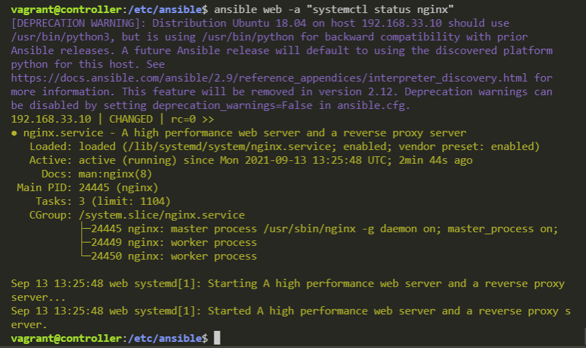

# Using Ansible - Infrastructure as Code
## Infrastructure as Code (IaC)
In the IT world, we want to have everything set up in an IaC format. This means we can automate lots of different things and it makes our lives much easier.

There are 2 forms of IaC, and some tools that can be used for each are listed:
1. Configuration management
    - Ansible
    - SolarWinds
    - Auvik
    - CFEngine
    - Puppet
    - CHEF
    - SALTSTACK
    - JUJU
2. Orchestration
    - Ansible
    - Nomad
    - Rancher
    - Kubernetes
    - Marathon
    - Mesosphere
    - Terraform

All of these tools work in either a *push* or *pull* configuration. Both these methods work in the same way that push adn pull works for Git.

## What is Ansible?
Ansible is an automation tool that allows you to change settings on multiple machines while only using 1 controller machine. In our example, we will only be using 3 machines, but in realisty, Ansible can be used to change settings on 10's or even hundreds of machines.


### Setting up the machines

The `VagrantFile` will setup 3 machines:
1. Controller
2. Web
3. db

After initialising these machines, we want to set them up using:
1. `sudo apt-get update -y`
2. `sudo apt-get upgrade -y`

### Installing Ansible
We only need to install Ansible on 1 machine and not on the machines that are controlled by Ansible. This is known as "agentless".

*Defintion of Agentless (from Whatis.com) = Agentless, in computing, refers to operations where no service, daemon or process (AKA an agent) needs to run in the background on the machine the action is being performed on.*

To install Ansible, execute the following commands:
```
sudo apt-get install software-properties-common -y
sudo apt-add-repository ppa:ansible/ansible
sudo apt-get install ansible -y
```

We can confirm that Ansible is installed by using `ansible --version`. This command will give information on the installed Ansible version and the location of the default configuration directories.
This machine is now the Ansible controller machine.

This can also be done by navigating to the default directory where Ansible's config files are stored > `cd /etc/ansible`

### Manual SSH with Ansible
To SSH into the agent machines, simply run `ssh vagrant@[machine-ip]`, where `[machine-ip]` is substituted for the machines IP address.

Can test the the connection works by running any command. To exit back to the controller machine's terminal, use `Exit`.

**MANUAL LOGIN MUST BE COMPLETED FIRST!! BEFORE ANSIBLE CAN AUTOMATICALLY LOGIN INTO THE MACHINE [FOR PLAYBOOKS]**

### Ansible configuration file, pinging and SSH login
We can ping the machines using the Ansible command > `ansible all -m ping`

When we execute this command, we will see this output:
```
[WARNING]: provided hosts list is empty, only localhost is available. Note that the        
implicit localhost does not match 'all'
```

#### Define the agent machines and ping

**MUST MANUALLY LOGIN FIRST!! REFER TO _Manual SSH with Ansible_**

We haven't defined what machines we want to control. So, we must now go into the Ansible config file and tell Ansible what machines to communicate with.

Go to the Ansible config directory > `cd /etc/ansible/`
Edit the `hosts` file and add the IP of your machines.

Execute the `ansible all -m ping` again. Now we get this output:


Edit the `/etc/ansible/hosts` file again and add the following variables after the machines IP address:
```
[web]
192.168.33.10 ansible_connection=ssh ansible_user=vagrant ansible_ssh_pass=vagrant
```

*(Within the `hosts` file, we can define tags such as `[web]` or `[db]` which can include multiple machine IP addresses)*

This tells Ansible to connect using SSH, and gives the connection a username and password.

Now if we execute the `ansible all -m ping`, we get the output:


__*You may see a depreciation warning, but this isn't anything to worry about.*__

We can ping the same machine using `ansible web -m ping` because we gave the web machine the `[web]` heading in the `hosts` file.

**Repeat the exact same process with the `db` machine _(and make sure to put it under the `[db]` header)_**

### Ad hoc commands
We can execute Adhoc commands using Ansible to obtain information about the agent machines. For example, we can find the name of our `web` machine like this > `ansible web -a "uname -a"` and we will see this output:


This is carrying out an "ad hoc" command on a single machine, but we can run the command on **all** our machines using only 1 command > `ansible all -a "uname -a"`

The basic idea is, we can use Ansible to execute any command we would normally use within the Linux terminal and Ansible will then show us the output of those commands from each machine.

The tructure of an ad-hoc command is as follows *(all on one line)*:

- `ansible` *(to use ansible)*
- `all` or `[tag]` **e.g. `web`** *(Defines what machines to execute the command on)*
- `-m <ModuleName>` *(Defines a module to use, other option flags are available)*
- `"CLI-command-here -a -b etc"` *(The command you want to run on the defined machines goes inside the quotes. It is written in the exact same way you'd write it if you were manually executing the command in the machine)*


`ansible web -m shell -a "cd ~" --become` *Changing directory with ad-hoc command*

---
## Ansible Playbooks
Ansible playbooks are a completely different way to use Ansible when compared to ad-hoc commands. The new goal is install the applications we need for the `web` and `db` machines. Instead of doing this manually for both machines, we can create playbooks.

Ansible playbooks are `.yml` files *(can also be written as `.yaml`)*. `YAML` stands for **Y**et **A**nother **M**arkup **L**anguage.

### Installing nginx using a playbook
Playbooks always start with 3 dashes > `---`

```YAML
# Create a playbook to install nginx web server on the web machine
# web > 192.168.33.10

# 3 dashes to tell the interpreter to start the YAML file
---
# Add the name of the host
- hosts: web
# Gather facts about the installation steps (optional)
# This prints to the terminal what is occuring behind the scenes
# (saying no will make the process quicker)
  gather_facts: yes
# We need admin access
  become: true
# Add instructions to install nginx
  tasks: 
  - name: Install Nginx
    apt: pkg=nginx state=present
# Ensure the nginx server is running
```

- The `- hosts: web` tells Ansible to perform the following tasks on all the machines that come under the `[web]` heading.
- The `gather_facts: yes` tells Ansible to print what it is doing to the terminal. *It basically just prints the task that it is currently completeing*
- The `become: true` line gives the YAML file admin access. *This is the same logging in as the root user, it is required to install applications*
- The next part is `tasks:`. This tells the YAML file that the following lines will be tasks.
- `- name: Install Nginx` creates a new task with the name *Install Nginx* and the following lines within the code block are part of that task
- `apt: pkg=nginx state=present` tells YAML to install the nginx package using the `apt` package manager. `state=present` tells YAML to ensure that the application is running.

The YAML file needs to be present within the `/etc/ansible` directory. To execute the playbook, the command is > `ansible-playbook nginx_playbook.yml`

After the playbook has finsihed running and installing nginx, we can check that it is running using and ad-hoc command > `ansible web -a "systemctl status nginx"`

We should see this output:



